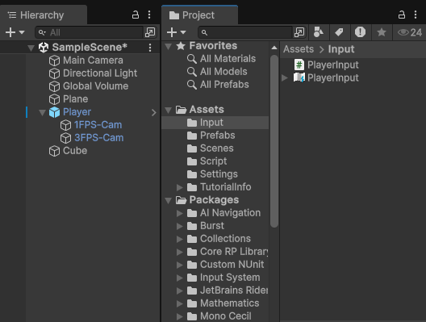
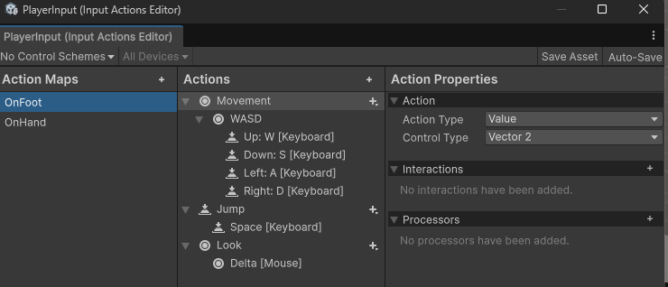
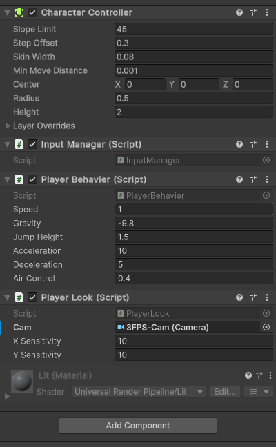
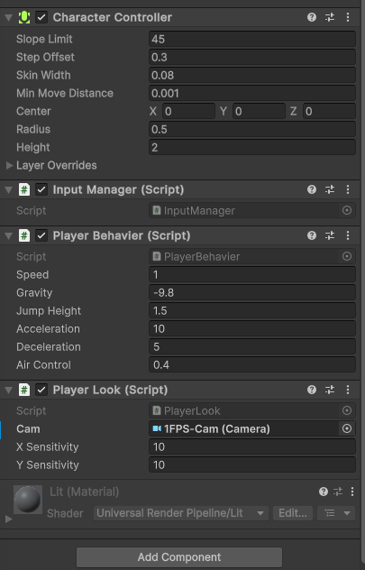

# Unity-PlayerMovement

A simple Unity 3D project that demonstrates basic first-person and third-person player movement with mouse-controlled camera movement


# 📌 Features
- 🎮 Basic first-person and third-person movement
- 🖱️ Mouse-controlled camera rotation
- 🧩 Easily customizable movement speed and jump height
- 🧪 Smooth controls for testing FPS at different performance levels
  
###
 


# 🎮 Player Movement
``` The player can move using WASD keys:
W: Move forward
S: Move backward
A: Move left
D: Move right
Spacebar: Jump
```



# Customization
You can change the jump height, movement speed or switch camera in the inspector panel below 

## Third-person 


## First-person


# 🎥 References
This is the step-by-step video that I followed

[](https://www.youtube.com/watch?v=rJqP5EesxLk)

### 💌 Thank you ᓚᘏᗢ for watching 💌

